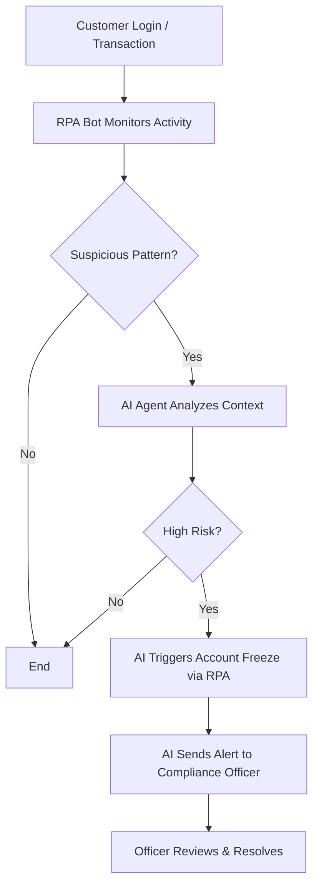

# AI-Prompt-Engineering
The process of producing input, typically text, that directs the generative AI to produce the intended output is known as AI Prompt Writing (or Engineering).

**AI + RPA** in a Bangladeshi banking context isn’t just smart—it’s future-ready. Let me walk you through a **visual mockup + process map** you can use for a **LinkedIn carousel** or **GitHub README**.

---

## 📊 AI + RPA in Bangladeshi Bank: Compliance Workflow

### 🧩 1. System Overview Diagram (Workflow Map)

```
Customer Activities → RPA → AI Agent → Compliance Desk
```

### 🔁 Full Process Flow



---

## 💼 Real Example: AML Compliance in Dhaka Branch

| Step | Actor        | Action Description                                                         |
|------|--------------|------------------------------------------------------------------------------|
| 1    | 🧍 Customer   | Makes an international transfer of BDT 9 lakh from a new device             |
| 2    | 🤖 RPA Bot    | Flags transaction based on rule (amount threshold + device fingerprint)     |
| 3    | 🧠 AI Agent   | Analyzes transfer history + IP location; confirms it’s statistically anomalous |
| 4    | ⚙️ RPA        | Automatically freezes transaction and sends OTP to confirm identity         |
| 5    | 🧠 AI Agent   | Generates a contextual summary + forwards it to the compliance officer      |
| 6    | 🧑‍💼 Officer   | Reviews and resolves alert via dashboard                                   |

---

## 🧠 Why It Works

| AI Agent                              | RPA Bot                                |
|---------------------------------------|----------------------------------------|
| Learns fraud patterns                 | Executes repetitive tasks (flag, freeze)|
| Explains decisions in natural language| Fills forms, sends alerts, logs changes |
| Adapts with time                      | Rules are fixed — fast but rigid        |

---

## 🔖 README Section for GitHub (Sample Snippet)

```markdown
## 🤖 AI + RPA: AML Compliance Assistant

This project demonstrates how to combine AI (for decision-making) and RPA (for task execution) in a Bangladeshi retail bank’s AML workflow.

### Features:
- Transaction anomaly detection using Isolation Forest
- RPA automation with Python & simulated email alerts
- Risk scoring + AI-generated explanations
```

---
