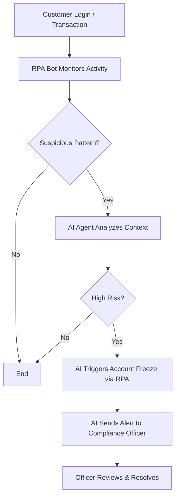

# AI-Prompt-Engineering
The process of producing input, typically text, that directs the generative AI to produce the intended output is known as AI Prompt Writing (or Engineering).

**AI + RPA** in a Bangladeshi banking context isn’t just smart—it’s future-ready. Let me walk you through a **visual mockup + process map** you can use for a **LinkedIn carousel** or **GitHub README**.

---

## 📊 AI + RPA in Bangladeshi Bank: Compliance Workflow

### 🧩 1. System Overview Diagram (Workflow Map)

```
Customer Activities → RPA → AI Agent → Compliance Desk
```

### 🔁 Full Process Flow



---

## 💼 Real Example: AML Compliance in Dhaka Branch

| Step | Actor        | Action Description                                                         |
|------|--------------|------------------------------------------------------------------------------|
| 1    | 🧍 Customer   | Makes an international transfer of BDT 9 lakh from a new device             |
| 2    | 🤖 RPA Bot    | Flags transaction based on rule (amount threshold + device fingerprint)     |
| 3    | 🧠 AI Agent   | Analyzes transfer history + IP location; confirms it’s statistically anomalous |
| 4    | ⚙️ RPA        | Automatically freezes transaction and sends OTP to confirm identity         |
| 5    | 🧠 AI Agent   | Generates a contextual summary + forwards it to the compliance officer      |
| 6    | 🧑‍💼 Officer   | Reviews and resolves alert via dashboard                                   |

---

## 🧠 Why It Works

| AI Agent                              | RPA Bot                                |
|---------------------------------------|----------------------------------------|
| Learns fraud patterns                 | Executes repetitive tasks (flag, freeze)|
| Explains decisions in natural language| Fills forms, sends alerts, logs changes |
| Adapts with time                      | Rules are fixed — fast but rigid        |

---

## 🔖 README Section for GitHub (Sample Snippet)

```markdown
## 🤖 AI + RPA: AML Compliance Assistant

This project demonstrates how to combine AI (for decision-making) and RPA (for task execution) in a Bangladeshi retail bank’s AML workflow.

### Features:
- Transaction anomaly detection using Isolation Forest
- RPA automation with Python & simulated email alerts
- Risk scoring + AI-generated explanations
```

---

# Develop a AI Agent to Analyzes transaction history from 1 corer data and provide alert if transaction found more than 10 lac per day, 50 lac per month and so on

Absolutely, Md! Let’s build a **scalable AI Agent** that can analyze **1 crore+ transaction records** and raise alerts based on **daily and monthly thresholds** — like ₹10 lakh/day or ₹50 lakh/month. This is a perfect blend of your BI storytelling skills and real-world financial intelligence.

---

## 🧠 What This AI Agent Will Do

| Capability                         | Description                                                                 |
|-----------------------------------|-----------------------------------------------------------------------------|
| ✅ **Ingest Large Datasets**       | Efficiently load and process 1 crore+ transactions                          |
| 📅 **Aggregate by Day/Month**      | Group transactions by user and time period                                 |
| 🚨 **Trigger Alerts**              | Raise flags if thresholds are breached (₹10L/day, ₹50L/month, etc.)        |
| 🧾 **Explain Alerts**              | Provide natural language summaries of why a user was flagged               |
| 📊 **Optional Dashboard**          | Visualize flagged users and trends (Streamlit or Power BI)                 |

---

## 🛠️ Step-by-Step Development (Python + Pandas)

### 1. 📦 Load the Dataset

```python
import pandas as pd

# Load CSV (assume columns: USER_ID, TXN_DATE, AMOUNT)
df = pd.read_csv("transactions.csv", parse_dates=["TXN_DATE"])
```

---

### 2. 📅 Add Time Features

```python
df['DATE'] = df['TXN_DATE'].dt.date
df['MONTH'] = df['TXN_DATE'].dt.to_period('M')
```

---

### 3. 📊 Aggregate Transactions

```python
# Daily aggregation
daily = df.groupby(['USER_ID', 'DATE'])['AMOUNT'].sum().reset_index()
daily['ALERT'] = daily['AMOUNT'] > 10_00_000  # ₹10 lakh

# Monthly aggregation
monthly = df.groupby(['USER_ID', 'MONTH'])['AMOUNT'].sum().reset_index()
monthly['ALERT'] = monthly['AMOUNT'] > 50_00_000  # ₹50 lakh
```

---

### 4. 🚨 Combine Alerts

```python
daily_alerts = daily[daily['ALERT']]
monthly_alerts = monthly[monthly['ALERT']]

# Merge for full alert report
alerts = pd.concat([daily_alerts.assign(TYPE='Daily'), monthly_alerts.assign(TYPE='Monthly')])
alerts = alerts.sort_values(by=['USER_ID', 'TYPE'])
```

---

### 5. 🧠 Add AI Explanation (Optional)

```python
def explain_alert(row):
    if row['TYPE'] == 'Daily':
        return f"User {row['USER_ID']} transacted ₹{row['AMOUNT']:,} on {row['DATE']} — exceeds ₹10L/day limit."
    else:
        return f"User {row['USER_ID']} transacted ₹{row['AMOUNT']:,} in {row['MONTH']} — exceeds ₹50L/month limit."

alerts['EXPLANATION'] = alerts.apply(explain_alert, axis=1)
```

---

### 6. 💾 Save or Visualize

```python
alerts.to_csv("flagged_transactions.csv", index=False)
```

Or visualize in **Streamlit**:

```python
import streamlit as st

st.title("🚨 Transaction Alert Dashboard")
st.dataframe(alerts)
```

---

## 🧩 Optional Enhancements

| Feature                        | Tools/Tech Stack                     |
|-------------------------------|--------------------------------------|
| Real-time ingestion            | Kafka, Spark Streaming               |
| Scalable storage               | PostgreSQL, BigQuery, Snowflake      |
| Alert delivery                 | Email, SMS, Slack via Webhooks       |
| AI explanations                | LangChain + OpenAI                   |
| Dashboard                      | Streamlit, Power BI, Tableau         |

---

## 🧠 Example Output

```
User 407 transacted ₹1,200,000 on 2025-03-20 — exceeds ₹10L/day limit.
User 407 transacted ₹5,800,000 in 2025-03 — exceeds ₹50L/month limit.
```

---

Would you like me to help you:
- Wrap this into a **GitHub project** with README and visuals?
- Turn it into a **LinkedIn carousel** for your BI + AI portfolio?
- Add **gender/demographic filters** for deeper insights?

Let’s make this a flagship piece in your AI storytelling toolkit.
